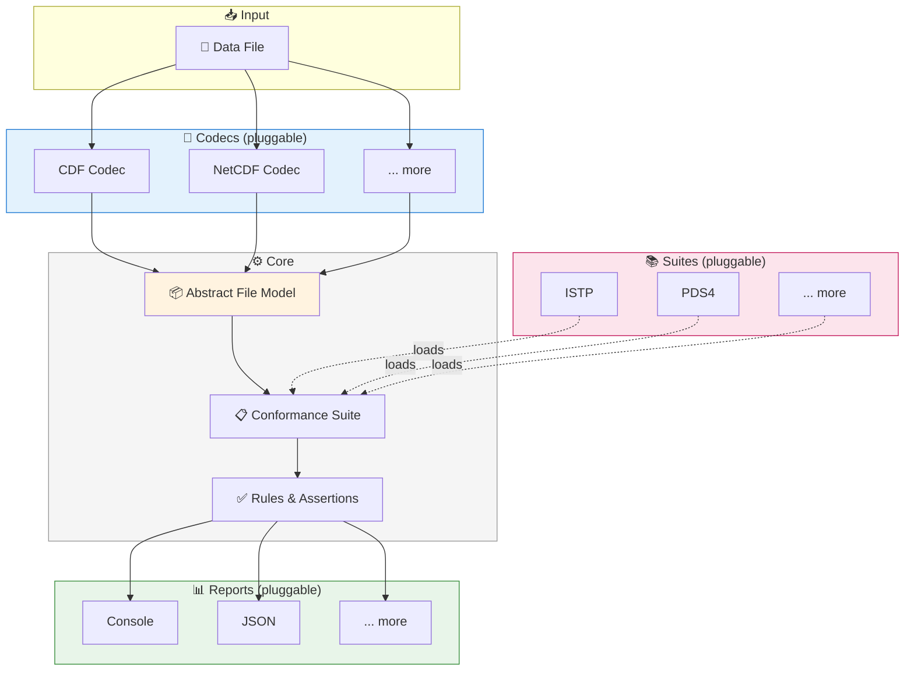

<h1 align="center">

</h1><br>

# AstraLint

AstraLint is a Python linter for Space Physics data files, validating conformance to standards such
as [ISTP](https://istp-metadata.readthedocs.io/) and [PDS4](https://pds.nasa.gov/datastandards/documents/).

<p align="center">
  <a href="https://sciqlop.github.io/AstraLint/"><strong>🚀 Try it online — no installation required!</strong></a>
</p>

## Install

AstraLint is published on PyPI. The simplest way to install is with pip:

```bash
pip install astralint
```

Note: PyPI package names are case-insensitive; `pip install AstraLint` also works. If you prefer using a virtual environment, create and activate one before installing.

## Overview

AstraLint validates data files against conformance suites using a **codec-agnostic architecture**:

1. **Codecs** transform file formats (e.g., CDF) into a common abstract representation ([
   `File`](src/astralint/base/file.py))
2. **Suites** define collections of validation rules (e.g., ISTP, PDS4)
3. **Rules** check specific requirements, defined either in Python or YAML

## Usage

```bash
# Lint a file against the default ISTP suite
astralint lint myfile.cdf

# Lint a multiple files at once
astralint lint file1.cdf file2.cdf file3.cdf

# Lint against a specific suite
astralint lint myfile.cdf --suite PDS4

# Select specific rules to run filtering by reference ID or name, regex supported
astralint lint myfile.cdf --suite ISTP --select "ISTP-MD-003" --select ".*GlobalAttributes"

# Ignore specific rules by reference ID or name, regex supported
astralint lint myfile.cdf --suite ISTP --ignore "ISTP-MD-00[0-9]" --ignore "MandatoryGlobalAttributes"

# Show every check, including the ones that passed (full tree)
astralint lint myfile.cdf --show-passed

# Show only failed assertions, pruning passed and skipped from the full tree
astralint lint myfile.cdf --show-passed --failed-only

# List available suites
astralint list-suites

# Strict mode: exit with error on warnings too
astralint lint myfile.cdf --strict

# Auto-fix deterministic ISTP issues and write a corrected copy (<stem>.fixed.cdf)
astralint fix myfile.cdf

# Dry run: list the proposed fixes without writing anything
astralint fix myfile.cdf --apply none
```

By default the console output is **quiet**, like a typical linter: it lists only
the errors and warnings that need attention, sorted by severity, and ends with a
one-line verdict (e.g. `✗ Found 7 problems (3 errors, 4 warnings), plus 13 info
findings`). Use `--show-passed` to see the full nested tree of every check, and
`--output html` for an interactive, filterable report.

AstraLint returns exit code `1` on validation errors (or warnings with `--strict`), making it suitable for CI/CD pipelines.

## Auto-fixing

AstraLint can propose and apply **deterministic** fixes for many ISTP issues. When
you lint a CDF, the verdict is followed by a hint pointing at the `fix` command:

```
✗ Found 8 problems (5 errors, 3 warnings)

→ 5 auto-fixable, 3 need review — run: astralint fix myfile.cdf
```

`astralint fix` runs a convergence loop — validate → propose fixes → apply the safe
ones → re-validate — until the file is clean or no further progress is made, then
writes a corrected copy:

```bash
# Apply the safe (auto) fixes; writes <stem>.fixed.cdf
astralint fix myfile.cdf

# Dry run: list every proposed fix (auto + staged) without writing
astralint fix myfile.cdf --apply none

# Choose the output path
astralint fix myfile.cdf --output corrected.cdf
```

Every proposed fix carries its **source**, **confidence**, and a one-line
**provenance note**, and falls into one of three dispositions:

- **auto** — deterministic and safe, applied automatically. Examples: a missing
  `FILLVAL` set to the ISTP default for the variable's type; `VAR_TYPE`/`DEPEND_0`
  inferred from the variable reference graph; `Logical_file_id`/`Logical_source`
  derived from an ISTP-conventional filename; an out-of-range `FILLVAL` reset to
  the standard fill; `Generation_date` reformatted to `yyyymmdd`.
- **staged** — computed but lossy or ambiguous, so it is *suggested* for review and
  never applied automatically. Examples: truncating an over-long
  `CATDESC`/`FIELDNAM`/`LABLAXIS`; a closest-name suggestion for a dangling
  `DEPEND_i`/`LABL_PTR_i` pointer.
- **needs your input** — irreducibly human and never fabricated (e.g. `UNITS`,
  `PI_name`, `DOI`).

Physical/numeric values (`UNITS`, `VALIDMIN`/`VALIDMAX`, …) and identity/provenance
attributes (`PI_name`, `DOI`, …) are **never** invented — they are only ever
reported, not auto-filled.

## Configuration

AstraLint can be configured via `pyproject.toml` or `.astralint.yaml`. Configuration is loaded with the following precedence (highest to lowest):

1. CLI arguments
2. `.astralint.yaml` (project root)
3. `pyproject.toml` `[tool.astralint]`
4. Built-in defaults

### Quick Start

```bash
# Generate a starter config file
astralint config init

# Validate your config file
astralint config validate

# Show resolved configuration (merged from all sources)
astralint config show
```

### Example `.astralint.yaml`

```yaml
suite: ISTP

select:
  - "MandatoryGlobalAttributes"
  - "ISTP-VAR-.*"

ignore:
  - "DeprecatedRule"

severity_overrides:
  ISTP-VAR-001: WARNING

extra_rules:
  - "./custom_rules/"

output:
  format: console
  verbose: false
  show_passed: true
```

### Example `pyproject.toml`

```toml
[tool.astralint]
suite = "ISTP"
select = ["MandatoryGlobalAttributes"]

[tool.astralint.output]
format = "html"
verbose = true
```

📖 **[Full Configuration Reference →](docs/config.md)**

## Architecture



## File Model

The abstract `File` model is the core data structure that all codecs produce. Rules and assertions operate on this unified representation:

```
File
├── filename: str                            # File name or identifier
├── extension: str                           # File extension (e.g., "cdf")
├── compression: str                     # e.g., "gzip", "none"
├── attributes: {name → Attribute}       # Global metadata
│   ├── "Project"      → Attribute
│   ├── "PI_name"      → Attribute
│   └── ...
└── variables: {name → Variable}         # Data variables
    ├── "Epoch" → Variable
    │   ├── name: str                    # "Epoch"
    │   ├── shape: [int]                 # e.g., [1440]
    │   ├── compression: str             # "gzip", "none"
    │   ├── data_type: DataType          # TT2000, FLOAT64, ...
    │   ├── record_variance: bool
    │   └── attributes: {name → Attribute}
    │       ├── "CATDESC"  → Attribute
    │       ├── "FILLVAL"  → Attribute
    │       └── ...
    ├── "Temperature" → Variable
    └── ...

Attribute
├── name: str
├── data_type: [DataType]                # List of data types
└── shape: [int]                         # Attribute dimensions

DataType = CHAR | UINT8 | UINT16 | UINT32 | UINT64
         | INT8 | INT16 | INT32 | INT64
         | FLOAT32 | FLOAT64
         | TT2000 | CDFEPOCH | CDFEPOCH16
```

### Path Navigation

Rules use `/`-separated paths with regex support to navigate the model:

| Path Example | Description |
|--------------|-------------|
| `attributes` | Global attributes dictionary |
| `attributes/Project` | Specific global attribute |
| `variables` | All variables dictionary |
| `variables/Epoch` | Specific variable |
| `variables/.*/attributes` | Attributes of all variables |
| `variables/Epoch/data_type` | Data type of a specific variable |
| `variables/Epoch/shape/0` | First dimension of variable shape |
| `attributes/Project/data_type/0` | First data type of attribute |

Lists are accessed using numeric indices: `path/to/list/0`, `path/to/list/1`, etc.

## Defining Rules in YAML

Rules can be defined declaratively in YAML files. Example from [
`MandatoryGlobalAttributes.yaml`](src/astralint/suites/ISTP/rules/GlobalAttributes/MandatoryGlobalAttributes.yaml):

```yaml
name: MandatoryGlobalAttributes
description: "All mandatory global attributes must be present"
url: "https://..."
reference: "ISTP-MD-003"
severity: ERROR
suite: ISTP

assertions:
  - path: "attributes"
    check: contains_keys
    keys:
      - Data_type
      - Logical_source
      - PI_name
    message: "Missing mandatory global attribute: {key}"

  - path: "variables/.*/attributes"
    check: contains_keys
    keys: [ CATDESC, FIELDNAM, FILLVAL ]
    message: "Variable missing required attribute: {key}"
```

### Available Assertions

| Category | Checks |
|----------|--------|
| **Existence** | `exists`, `not_exists` |
| **Value** | `comparison`, `range`, `is_type` |
| **String** | `matches` |
| **Collection** | `contains_keys`, `in`, `not_in`, `length`, `not_empty`, `requires`, `array_shape` |
| **Relationship** | `reference_variable`, `compare_to` |
| **Combinators** | `all_of`, `any_of`, `any_match`, `none_of`, `not`, `one_of`, `at_least`, `at_most`, `exactly` |
| **Conditional** | `if_then`, `if_then_else` |

📖 **[Full Assertions Reference →](docs/assertions.md)**

## Supported File Formats

| Format | Extension                | Library                                       |
|--------|--------------------------|-----------------------------------------------|
| CDF    | `.cdf`                   | [pycdfpp](https://github.com/SciQLop/pycdfpp) |
| FITS   | `.fits`, `.fit`, `.fts`  | [astropy](https://www.astropy.org/)           |

## Available Conformance Suites (WIP/Demo)

- **ISTP** - [ISTP Metadata Guidelines](https://istp-metadata.readthedocs.io/)
- **CDAWeb** - [CDAWeb](https://cdaweb.gsfc.nasa.gov/) ingestion profile: inherits ISTP and promotes the CDAWeb-required attributes (`Instrument_type`, `Mission_group`) to errors, plus CDAWeb-specific entry limits
- **PDS4** - PDS4 CDF archiving profile (CDF-A): inherits ISTP and adds the constraints from the [Guide to Archiving CDF Files in PDS4](https://pds.nasa.gov/datastandards/documents/archiving/Guide-to-Archiving-CDF-Files-in-PDS4-v7.pdf) — no file/variable compression, CDF version ≥ 3.4, and a required `spase_DatasetResourceID`. Two remaining structural requirements (contiguous variables, zVariables-only) await pycdfpp support; see the codec backlog below.
- **SOLARNET** - [SOLARNET Metadata Recommendations](https://solarnet.readthedocs.io/en/stable/index.html)

### PDS4 codec backlog

Of the CDF-A structural requirements, two cannot yet be checked because **pycdfpp does not
expose** the needed information (verified against pycdfpp 0.10.0). Implementing them means
adding bindings upstream in [pycdfpp](https://github.com/SciQLop/pycdfpp), surfacing the flags
on the `Variable` model, then adding `PDS4-CDFA-004/005` rules:

- **Contiguous (non-fragmented) variables** — pycdfpp abstracts the physical VVR layout away on read.
- **zVariables only** (no rVariables) — pycdfpp exposes no r/z distinction.

The *single-file* requirement is satisfied by construction: AstraLint only loads single-file
CDFs. (See [issue #2](https://github.com/SciQLop/AstraLint/issues/2).)

## Extending AstraLint

### Adding a New Codec

Create a new codec in `src/astralint/codecs/`. Subclasses register themselves
automatically via `__init_subclass__`, so simply defining the class and importing
the module is enough to make the codec available:

```python
from astralint.base import Codec, File


class MyCodec(Codec):
    @classmethod
    def supported_extensions(cls) -> list[str]:
        return ["ext"]

    @staticmethod
    def load(file_url_or_bytes: str | bytes) -> File | None:
        # Transform your file format into the abstract File model
        ...
```

For remote files, AstraLint provides `get_remote_file(url) -> bytes` to fetch
remote content and `is_remote_file(url) -> bool` to detect URLs.

### Adding a New Assertion Type

Create a new assertion in `src/astralint/base/yaml_rules/assertions/`. Subclasses
of `BaseAssertion` are auto-registered into the discriminated union via the
`check` field's Literal value:

```python
from typing import Any, Literal

from astralint.base import File, Severity, ValidationResult
from astralint.base.yaml_rules.assertions.base import BaseAssertion


class MyAssertion(BaseAssertion):
    check: Literal["my_check"] = "my_check"

    # Add custom fields as needed; they are populated from the YAML rule definition.
    # expected_value: Any

    def single_assertion(
        self,
        file: File,
        path: str,
        value: Any,
        severity: Severity,
        captures: dict[str, str] | None = None,
    ) -> ValidationResult:
        # Called once per (path, value) pair that matched the base assertion's path
        # pattern. `captures` holds named groups from {name} placeholders, if any.
        ...
```

* * *

## Project Docs

For how to install uv and Python, see [installation.md](docs/installation.md).

For development workflows, see [development.md](docs/development.md).

For instructions on publishing to PyPI, see [publishing.md](docs/publishing.md).

* * *

*This project was built from
[simple-modern-uv](https://github.com/jlevy/simple-modern-uv).*
